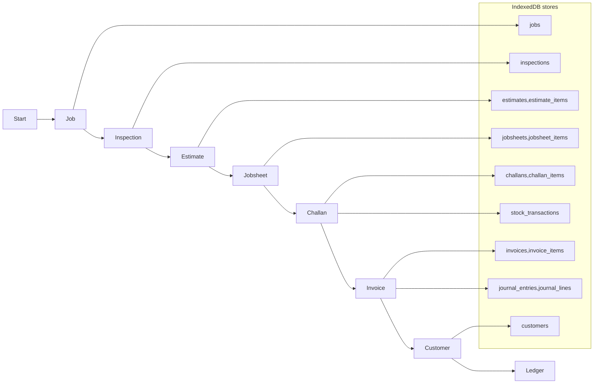

# JOB_MODULE_RELATION.md

## Purpose

This document is the authoritative Job-module relation spec for Malwa CRM. It maps **every Job-related page** to IndexedDB stores, describes data flows, transaction rules, Electron file interactions, sync behavior, indexes to create, QA acceptance tests, and developer handoff instructions. Use this file when implementing the Job module, creating migrations, or giving tasks to an AI/human dev.

---

## Quick flow (top-level)

```
Start → Job → Inspection → Estimate → Job Sheet → Challan → Invoice → Customer → Ledger
```

This is the canonical sequence. Each arrow represents a persistent relation in IndexedDB and often a required multi-store transaction for atomicity.

---

## Stores involved (primary)

* `jobs`
* `inspections`
* `estimates`
* `estimate_items`
* `jobsheets`
* `jobsheet_items`
* `challans`
* `challan_items`
* `stock_transactions`
* `invoices`
* `invoice_items`
* `journal_entries`
* `journal_lines`
* `customers`
* `products`
* `payments`
* `offline_operations`
* `meta`
* `conflicts`

---

## Indexes to create (critical)

* `jobs`: `status`, `customerId`, `scheduledStart`, `createdAt`
* `inspections`: `jobId`, `createdAt`
* `estimates`: `customerId`, `jobId`, `date`
* `estimate_items`: `estimateId`, `productId`
* `jobsheets`: `jobId`, `technicianId`, `date`
* `jobsheet_items`: `jobsheetId`, `productId`, `isIssued`
* `challans`: `jobId`, `customerId`, `date`
* `challan_items`: `challanId`, `productId`
* `stock_transactions`: `productId`, `referenceType`, `referenceId`, `createdAt`
* `invoices`: `jobId`, `customerId`, `status`, `date`
* `invoice_items`: `invoiceId`, `productId`
* `journal_entries`: `sourceType`, `sourceId`, `date`
* `journal_lines`: `journalEntryId`, `accountId`
* `offline_operations`: `status`, `createdAt`, `priority`

---

## Page-by-page mapping

Each page shows which stores it reads/writes, transaction guidance, indexes to use, electron duties, offline behavior and acceptance tests.

### 1) Job List (`/jobs`)

* **Reads:** `jobs` (index: `status`, `createdAt`), `customers` (bulkGet)
* **Writes:** minimal; status updates possible
* **Txn:** not required for read; use txn for batch status edits
* **Electron:** export jobs via `backup.export`
* **Offline:** read-only; show `syncStatus` per item
* **Acceptance:** list loads <500ms for 500 jobs

### 2) Job Detail (`/jobs/:id`)

* **Reads:** `jobs.get(id)`, `inspections.query(jobId)`, `jobsheets.query(jobId)`, `challans.query(jobId)`, `invoices.query(jobId)`, `customers.get(job.customerId)`
* **Writes:** job update, link estimate
* **Txn:** converting estimate → job requires txn across `estimates` (update) + `jobs` (create)
* **Electron:** export subset (jobs + related stores)
* **Offline:** local first, enqueue composite op for conversion
* **Acceptance:** convert estimate → job atomic

### 3) Inspection (`/jobs/:id/inspection`)

* **Reads:** `jobs.get(jobId)`, previous `inspections`
* **Writes:** `inspections.put()` (may include photos)
* **Txn:** if inspection updates estimate scope, include estimate changes in same txn
* **Electron:** save photos via `fs.writeAtomic`; store path in inspection record
* **Offline:** allow photo save & mark `syncStatus`
* **Acceptance:** inspection + photo saved; file exists on disk

### 4) Estimate (`/estimates/:id` or `/jobs?step=estimate`)

* **Reads:** `products`, `customers`, `estimates`
* **Writes:** `estimates.put()`, `estimate_items.bulkPut()` — **Txn required**
* **Electron:** export estimate JSON/PDF
* **Offline:** composite op for estimate
* **Acceptance:** parent + items created with correct totals

### 5) Jobsheet (`/jobs/:id/jobsheet`)

* **Reads:** `jobsheets.query(jobId)`, `jobsheet_items`
* **Writes:** `jobsheets.put()`, `jobsheet_items.bulkPut()` — **Txn required**
* **Electron:** save signatures/photos via IPC
* **Offline:** enqueue op; show pending approvals
* **Acceptance:** create jobsheet and items, visible in job detail

### 6) Challan (`/challans/:id` or from jobsheet)

* **Reads:** `jobsheet_items`, `products`
* **Writes (atomic):** `challans.put()`, `challan_items.bulkPut()`, `stock_transactions.bulkPut()`, update `jobsheet_items.isIssued` — **ALL in one tx**
* **Electron:** log & export, save challan PDF
* **Offline:** allow creation, `stock_transactions` marked pending; enqueue composite op
* **Acceptance:** issuance reduces computed stock via sum of `stock_transactions`

### 7) Invoice (`/invoices/:id` or from challan)`

* **Reads:** `challans`, `jobsheets`, `estimates`, `products`, `accounts`
* **Writes (atomic):** `invoices.put()`, `invoice_items.bulkPut()`, `journal_entries.put()`, `journal_lines.bulkPut()` — **ALL in one tx**
* **Electron:** generate PDF, save
* **Offline:** composite op (invoice + journal); high priority
* **Acceptance:** posting invoice creates balanced journal entries

### 8) Customer & Ledger (`/customers/:id` and `/ledger`)

* **Reads:** `customers.get()`, `invoices.query(customerId)`, `payments.query(customerId)`, `journal_entries`/`journal_lines`
* **Writes:** customer updates
* **Electron:** export customer ledger
* **Offline:** reflect local invoices & payments; show unsynced indicators
* **Acceptance:** ledger shows accurate balances from invoices & payments

---

## Transaction best practices

* Use short-lived transactions; break very-large imports into batches (e.g., 500 records/txn).
* Always include `offline_operations` enqueue in the same transaction as data writes for composite ops.
* Validate invariants inside the transaction (invoice totals, journal balancing, stock availability) before commit; abort if invalid.

---

## Sync & offline_operations pattern

1. Writes happen locally immediately.
2. If the operation affects remote state, add composite op to `offline_operations` within same transaction.
3. `syncManager` processes ops FIFO (priority rules possible). On success, update local records with server `version` and remove op. On conflict, create `conflicts` entry.
4. Accounting & stock ops receive higher `priority`.

**Composite op example:**

```json
{
  "id":"op-uuid",
  "opType":"composite",
  "stores":["invoices","invoice_items","journal_entries"],
  "payload":{...},
  "priority":"high"
}
```

---

## Electron IPC contract (Job-module relevant)

* `ipc.invoke('fs.checkPath', {path}) -> {exists, writable}`
* `ipc.invoke('backup.export', {stores:['jobs','jobsheets','challans','invoices'], filter:{jobId}}) -> {backupPath, counts}`
* `ipc.invoke('backup.import', {sourcePath}) -> {importReport}`
* `ipc.invoke('fs.writeAtomic', {path, dataBuffer}) -> {ok:true}`  // use for PDFs/photos
* `ipc.invoke('fs.readFileStream', {path}) -> streamHandle` // large imports

**Security:** main must validate paths to root `C:\malwa-crm\db` or `app.getPath('userData')` and sanitize filenames.

---

## Data integrity & validation rules (Job-specific)

* **Estimate totals** must equal sum(estimate_items.amount) within rounding tolerance.
* **Invoice posting** must create balanced journals (debits == credits).
* **Stock issue** should not allow negative stock unless configured; warn user and log reasons.
* **Jobsheet approval** must verify labor hours and item availability before issuing.

---

## Acceptance tests (Step 1: Job Module)

1. Create Job and verify appears in Job List.
2. Create Inspection with photo: inspection stored; photo saved to disk path returned by IPC.
3. Create Estimate with 5 items: items linked and totals correct.
4. Convert Estimate → Job: `estimates.status` updated and `jobs` created atomically.
5. Create Jobsheet, approve and issue materials: `challan`, `stock_transactions`, and `jobsheet_items.isIssued` update in one transaction.
6. Create Invoice from challan: invoice and balanced journal entries created atomically.
7. Offline create invoice: `offline_operations` contains composite op; on simulated sync, local versions updated and op removed.
8. Export Job subset via Electron: files written atomically under `C:\malwa-crm\db\backups\`.

---

## Developer handoff (copy-paste)

```
Task: Implement Job module storage & flows
1. Ensure stores & indexes exist as listed in JOB_MODULE_RELATION.md
2. Implement db-adapter helper methods: openDB(schema), transaction(stores, mode, cb), bulkPut, bulkGet
3. Implement create/update flows for: inspections, estimates, jobsheets, challans, invoices using recommended transactions
4. On multi-store operations (challan issue, invoice post), write composite `offline_operations` in same transaction
5. Add Electron IPC handlers in main for backup.export, backup.import, fs.writeAtomic, fs.readFileStream
6. Add unit & integration tests per Acceptance tests section
7. Provide clear UI `syncStatus` and conflict badge for job-related records
```

---

## Mermaid diagram (paste into Markdown that supports Mermaid)



---

## Appendix — sample JSON snippets

**Challan + stock transaction composite payload**

```json
{
  "challan": {"id":"chal-1","jobId":"job-1","date":"2025-11-15T10:00:00Z"},
  "challan_items":[{"id":"ci-1","challanId":"chal-1","productId":"prod-1","qty":2}],
  "stock_transactions":[{"id":"st-1","referenceType":"challan","referenceId":"chal-1","productId":"prod-1","qty":-2}]
}
```

**Invoice composite payload**

```json
{
  "invoice": {"id":"inv-1","customerId":"cust-1","total":1180},
  "invoice_items":[{"id":"ii-1","invoiceId":"inv-1","productId":"prod-1","qty":2,"amount":1000}],
  "journal_entry": {"id":"je-1","sourceType":"invoice","sourceId":"inv-1"},
  "journal_lines": [ {"id":"jl-1","journalEntryId":"je-1","accountId":"AR","debit":1180}, {"id":"jl-2","journalEntryId":"je-1","accountId":"Sales","credit":1000} ]
}
```

---


