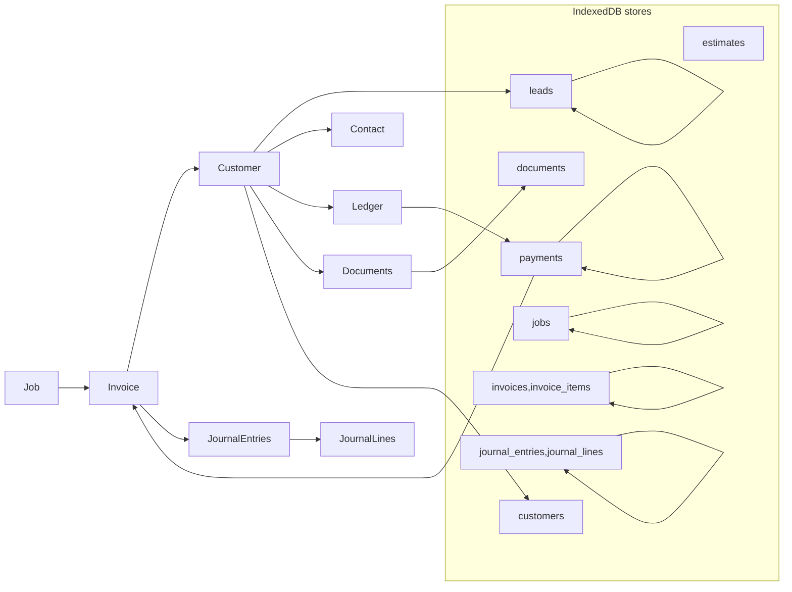

# CUSTOMER_MODULE_RELATION.md

## Purpose

This document is the authoritative **Customer module** relation spec for Malwa CRM, created to match the flow and arrows in your provided diagram. It maps every customer-related page (Leads, Contact/Detail, Ledger) to IndexedDB stores, explains data flows, transaction rules, Electron file duties, sync/offline behavior, validation, QA acceptance tests, and developer handoff actions.

Use this file when implementing the Customer module, writing migrations, or assigning tasks to an AI/human developer.

*Last updated: 2025-11-15*

---

## Canonical flow (as in the image)

```
Start → Job → ... → Invoice → Customer → Leads → Contact → Ledger
                              ↘                        ↑
                               ↘——————— Payments / Cash Receipt ——————↗
```

In short: Customer is the hub that links Jobs, Estimates, Invoices, Payments, and Ledger. The diagram shows Customer pages feeding into Ledger and interacting with Accounts, GST and Cash Receipt flows.

---

## Primary stores used by Customer module

* `customers` (master)
* `leads` (optional separate store or customers with `type:lead`)
* `contacts` (if separate from `customers`)
* `jobs` (customerId)
* `estimates` (customerId)
* `invoices` (customerId)
* `invoice_items`
* `payments` (customerId, invoiceId)
* `journal_entries` / `journal_lines`
* `ledger_views` (materialized per-customer analytics/cache)
* `offline_operations`
* `meta`
* `conflicts`
* `documents` (attachments: signed proposals, contracts, PDFs) — optional store holding file paths

**Indexes (critical):**

* `customers`: `email`, `phone`, `code`, `createdAt`
* `leads`: `status`, `createdAt`
* `jobs`: `customerId`, `status`
* `estimates`: `customerId`, `date`
* `invoices`: `customerId`, `status`, `date`
* `payments`: `invoiceId`, `customerId`, `date`
* `journal_entries`: `sourceType`, `sourceId`, `date`
* `journal_lines`: `accountId`, `journalEntryId`

---

## Page-by-page mapping (image-accurate order)

The image places Customer (with Leads & Contact) vertically near Invoice and Ledger. Below we map pages and flows exactly.

### 1) Customer / Leads List (`/customers` or `/leads`)

**Purpose:** list customers/leads, quick create, convert lead → customer

* **Reads:** `customers` (or `leads` store filtered), `jobs` summary count per customer (use `jobs.customerId` index)
* **Writes:** create lead/customer (W)
* **Txn:** lead → customer conversion (if moving child records) should be atomic: update `leads` (mark converted) + create `customers` record in same tx OR simply set `type` in `customers` record.
* **Electron:** export customer/leads list via `backup.export` to `C:\malwa-crm\db\customers.json`
* **Offline:** create leads locally; enqueue op if need server replication
* **Acceptance tests:** create lead → appears in list; convert lead → new customer record exists and lead marked converted

### 2) Customer Detail / Contact (`/customers/:id`)

**Purpose:** manage contact info, addresses, linked jobs/estimates/invoices

* **Reads:** `customers.get(id)`, `jobs.query({index:'customerId', value:id})`, `estimates.query({customerId})`, `invoices.query({customerId})`, `payments.query({customerId})`
* **Writes:** update customer details, add/remove contacts, upload documents (attachments)
* **Indexes:** `jobs.customerId`, `invoices.customerId`, `payments.customerId`
* **Txn:** when updating customer AND relocating child records (rare) use txn to guarantee consistency
* **Electron:** save attachments (contracts, signed estimates) via `fs.writeAtomic` and store path in `documents` store or `customers.documents[]`
* **Offline:** allow updates locally and mark `syncStatus` with `offline_operations` enqueue in same tx
* **Acceptance tests:** update address → reflected on invoices preview; upload contract → file saved on disk and path stored

### 3) Customer Ledger / Account Statement (`/customers/:id/ledger`)

**Purpose:** show ledger (AR), invoices, payments, journal entries related to customer

* **Reads:** `invoices.query({index:'customerId', range:period})`, `payments.query({customerId})`, `journal_entries` where `sourceType='invoice' and sourceId in invoiceIds` or `journal_lines` referencing customer accounts
* **Writes:** none usually (payments or adjustments via Payment page / Voucher)
* **Indexes to use:** `invoices.customerId`, `payments.customerId`, `journal_entries.sourceType/sourceId`
* **Electron:** export ledger as CSV/PDF via `fs.writeAtomic` or `accounts.export`
* **Offline:** compute ledger from local stores; annotate items that are unsynced; warn that totals may change once sync completes
* **Acceptance tests:** ledger running balance matches `SUM(invoice.total) - SUM(payments.applied)` and matches journal entries

### 4) Quick Actions tied to Customer (from diagram arrows)

The image shows arrows from Customer to Ledger, and back from Ledger to Accounts & Cash Receipt. These correspond to actions like `Create Invoice`, `Record Payment`, `Create Voucher`.

**Create Invoice (from Customer):** open invoice form prefilling customer. Create `invoice` + `invoice_items` + `journal_entries` (atomic). Enqueue composite op.

**Record Payment (Cash Receipt):** open payment form referencing invoice(s); create `payment`, `journal_entry` and update `invoice.paidAmount` (atomic). Enqueue composite op.

**Create Voucher (Adjustment):** manual journal for customer-specific adjustments (credit notes, write-offs). Create `journal_entry` + `journal_lines` and link `sourceType='customer_adjustment'`.

---

## Data relations and FK mapping (image-derived)

All FK enforcement is application-level (IndexedDB doesn't enforce FKs). Use these relations:

* `jobs.customerId -> customers.id`
* `estimates.customerId -> customers.id`
* `invoices.customerId -> customers.id`
* `invoice_items.invoiceId -> invoices.id`
* `payments.invoiceId -> invoices.id`
* `payments.customerId -> customers.id`
* `journal_entries.sourceType='invoice' & sourceId -> invoices.id`
* `journal_lines.journalEntryId -> journal_entries.id`
* `customers.documents[]` or `documents.customerId -> customers.id`

---

## Transaction patterns (customer-centric)

### A) Create Invoice from Customer (atomic)

Stores: `invoices`, `invoice_items`, `journal_entries`, `journal_lines`, optionally `offline_operations`
Steps:

1. Validate item sums
2. Begin tx (readwrite across these stores)
3. Put `invoice` and `invoice_items`
4. Put `journal_entry` and `journal_lines` (balanced)
5. Enqueue `offline_operations` composite op (if offline or always include op for sync)
6. Commit

### B) Record Payment (Cash Receipt)

Stores: `payments`, `journal_entries`, `journal_lines`, `invoices`
Steps:

1. Begin tx
2. Put `payment` record
3. Put `journal_entry` and `journal_lines` (Bank/Cash debit, AR credit)
4. Update `invoice.paidAmount` and status if fully paid
5. Enqueue `offline_operations`
6. Commit

### C) Update Customer with Attachment

Stores: `documents`, `customers`
Steps:

1. Use Electron `fs.writeAtomic` to save file to disk; return path
2. Begin tx and put document record with file path and update `customers.documents[]`
3. Commit

---

## Electron responsibilities (Customer flows)

* **Attachments:** save scanned contracts, signed estimates, or ID docs via `ipc.invoke('fs.writeAtomic')` and return file path to renderer to store in `documents`/`customers`.
* **Export Ledger / Customer Data:** `ipc.invoke('backup.export', {stores:['customers','invoices','payments'], filter:{customerId}})` to produce subset export in `C:\malwa-crm\db\backups\<timestamp>\`.
* **Import:** import customer lists via `ipc.invoke('backup.import', {sourcePath})` streaming into IndexedDB in batches.
* **Security:** validate paths and limit to configured root.

---

## Sync & offline rules (customer-focused)

* Always create a composite `offline_operations` op when creating or editing records that must be replicated (invoice, payment, customer create/update) inside same IndexedDB transaction.
* Prioritize payment ops higher than non-financial ops.
* On sync success: update local `version` and `id` (if server returns different id), and mark `syncStatus='synced'`.
* On conflict: write to `conflicts` with `local` and `remote` payloads and surface to admin UI (customer data conflicts must be resolved manually when name/addresses change).

---

## Validation & business rules (customer)

* **Unique contact points:** `email` or `phone` duplicates should be flagged at import and creation; require user de-duplication flow.
* **Invoice creation:** ensure customer has required billing details (GSTIN, billing address) if invoice requires tax fields.
* **Payments:** do not allow payment bigger than outstanding without explicit warning/confirmation.
* **Attachments:** limit file size and validate file types; store path and metadata (size, checksum) in `documents` store.

---

## Acceptance tests (Customer module)

1. **Create lead & convert to customer**: create lead record → convert successfully into customer and link no children lost
2. **Customer detail update & attachment**: upload contract → file saved to disk; document path stored in customer record
3. **Invoice from customer**: create invoice for customer with 3 items → invoice and journal entries created atomically and `offline_operations` enqueued if offline
4. **Make payment**: record payment for invoice → payment exists, `invoice.paidAmount` updated, journal balanced
5. **Customer ledger**: ledger running balance equals `sum(invoices) - sum(payments)` and lines match journal entries
6. **Export/Import**: export customer data → delete local customer → import backup → customer restored with same id & linked invoices
7. **Conflict**: modify customer on two clients (simulate) → sync leads to `conflicts` record and UI allows manual resolution

---

## Developer handoff snippet (copy-paste)

```
Implement Customer module:
1. Create or verify stores & indexes: customers, invoices, payments, documents, jobs, estimates
2. Implement customer detail UI reading linked jobs/estimates/invoices (use bulkGet for products/accounts)
3. Implement createInvoiceFromCustomer flow: invoices + invoice_items + journal_entries in atomic txn and enqueue offline_operations
4. Implement recordPayment flow: payments + journal_entries + invoice update in atomic txn
5. Implement attachment save via Electron ipc.invoke('fs.writeAtomic') and store path
6. Add duplicate detection on customer create/import
7. Add unit and integration tests per acceptance tests
```

---

## Mermaid diagram (paste in MD renderer that supports Mermaid)



---

## Appendix — example composite op payloads (customer)

**Create invoice composite op**

```json
{
  "opId":"op-invoice-20251115-001",
  "stores":["invoices","invoice_items","journal_entries","journal_lines"],
  "payload":{
    "invoice":{...},
    "invoice_items":[...],
    "journal_entry":{...},
    "journal_lines":[...]
  },
  "priority":"high"
}
```

**Payment composite op**

```json
{
  "opId":"op-payment-20251115-001",
  "stores":["payments","journal_entries","journal_lines","invoices"],
  "payload":{ /* payment and invoice update */ },
  "priority":"high"
}
```

---

If you want I will now:

* add `src/db/schema/customer-schema.json` (machine-readable) to the canvas, or
* generate `db-adapter` pseudo-code for `createInvoiceFromCustomer` and `recordPayment` flows, or
* scaffold Playwright/Electron tests for the customer acceptance tests.

Which one should I add next?
